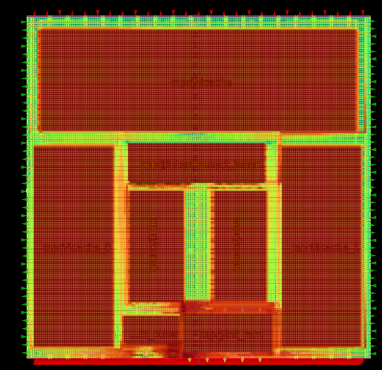
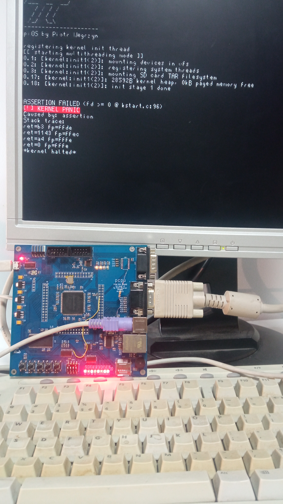

# ppcpu_caravel

[Pipelined pcpu](https://github.com/piotro888/ppcpu) synthetised on silicon for OpenMPW shuttle.
 
Edition: `gfmpw1`



## ppcpu

PPCPU is a pipelined procesor made entirely from scratch. It uses custom RISC-type ISA. 

PPCPU is a third revision of pcpu project (that started in 2019) that is an advanced and functional processor.
It is capable of running full operating systems (like [piOS](https://github.com/piotro888/pios)), with complete process isolation.
LLVM backend PPCPU is available.

This design is integrated with two PPCPU cores, data cache, instruction caches, CW bus and embedded module.

Main cpu bus is exported to I/O pins as CW (Compressed Wishbone (due to pin count limitations)) bus. It allows to connect large external memory and many peripherals to the projects.

Addtionaly, embedded module is available, with internal memory that can be programmed with SPI interface. It allows to test the project without connecting main CW bus, in "microcontroller" mode. SPI inteface provides access to main system bus.

## Features

* 16-bit custom RISC type architecture
* 4-stage pipelined microarchitecture
* Multi-core operation (with two cores included in this project)
* Memory paging, virtualization and protection
* 24-bit supported address space
* Full main memory bus available via I/O pins as Compressed Wishbone bus.
* Instruction and data caches
* Interrupts
* Production testing embedded mode

## Tests

This CPU configuration (wrapped in SoC) is fully functional and tested on a real-world FPGA circuit.



Test testing boot and basic operation of core via Caravel I/O intefaces (CW bus and embed mode) are located in `verilog/dv/`.
See [dv README](verilog/dv/README.md) for details about dv tests in this repository.


## Structure

```nim
  [CORE 0]<->[I&D MMU]<->[                      ]     [                    ] <>  [    MAIN OUTSIDE CW BUS            ]
                         [  INNER_INTERCONNECT  ] <-> [ OUTER_INTERCONNECT ] 
  [CORE 1]<->[I&D MMU]<->[                      ]     [ +CLOCKING & CDC    ] <>  [EMBEDDED MODULE - SPI TO WB BRIDGE,]
                          ^v         ^v        ^v                                [INTERNAL RAM, GPIO                 ]
                      [ICACHE 0] [ICACHE 1] [DCACHE]

  | CORE | INTERNAL BUS             |           WISHBONE BUS    |  COMPRESSED WISHBONE BUS                            |
```

## Pins

|GPIO|DIR|FUNCTION|
|----|---|--------|
|7:0  |BI | Memory mapped GPIO pins, available to PPCPU. Some of the pins are reserved by Caravel during boot |
|8    |OUT| `cw_req`: Compressed Wishbone bus - Start of request |
|9    |OUT| `cw_dir`: Compressed Wishbone bus - Direction of `cw_io` |
|25:10|BI | `cw_io`: Compressed Wishbone bus -  Multi-cycle address & bidirectional data |
|26   |IN | `cw_ack`: Compressed Wishbone bus - request ack |
|27   |IN | `cw_err`: Compressed Wishbone bus - request error |
|28   |OUT| const 1 |
|29   |OUT| `cw_rst`: Core reset signal |
|30   |IN | external interrupt |
|31   |IN | Enable split of CW clock from CORE clock (divisor configurable via MMIO) |
|32   |IN | Hold core operations |
|33   |IN | Enabled embed mode |
|34   |IN | SPI interface clk |
|35   |IN | SPI interface MOSI |
|36   |OUT| SPI interface MISO | 
|37   |OUT| `cw_clk`: CW clock ouput |

## Docs

ISA and core documentation is available in main PPCPU repository.

`cpuid` for this tapeout: `1110(silicon)_0011_0011(arch3.3)_0000(si/to0)`

## Author

`PPCPU by Piotr Wegrzyn`

Thanks for amazing Open Source tools and projects that made this possible!
